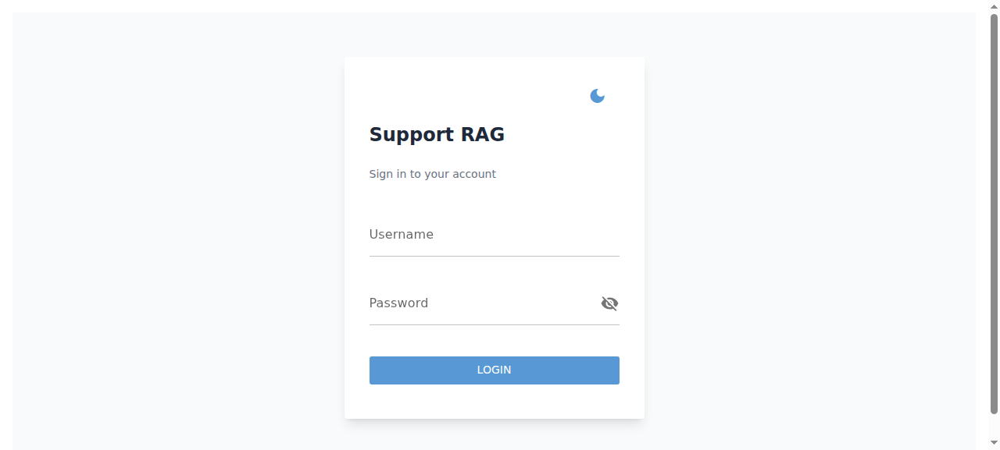
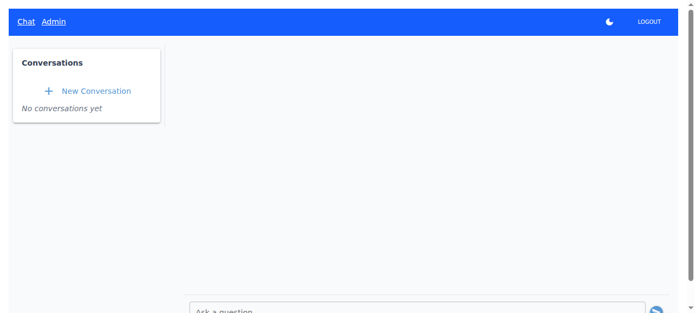
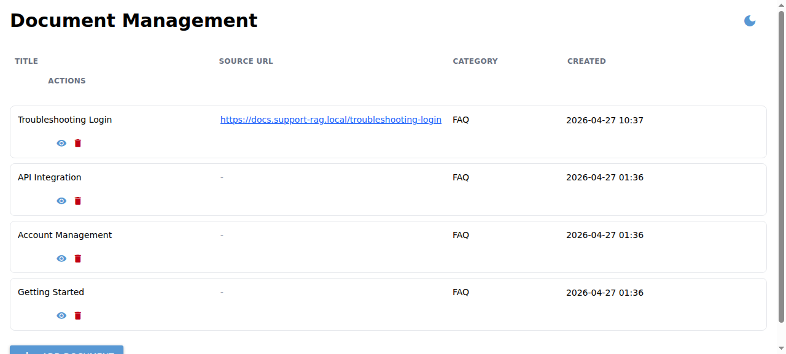

# Support RAG

NiceGUI-based support assistant with retrieval-augmented generation (RAG), admin document ingestion, auth, and conversation history.

## English

### What this project does

- Serves a chat UI at `/` for authenticated users.
- Retrieves relevant document chunks, reranks them, and streams an answer from OpenRouter.
- Escalates low-confidence queries to a human-support fallback response.
- Provides an admin page at `/admin` to create/delete source documents.
- Persists conversations/messages to the database.
- Supports dark mode with per-user preference persistence.

### Architecture at a glance

```text
Browser (NiceGUI pages)
  -> Auth middleware (cookie JWT)
  -> RAG pipeline
       -> Embeddings + similarity search
       -> Reranker
       -> Context builder
       -> OpenRouter streaming LLM
  -> SQLAlchemy models/storage
       users, documents, chunks, embeddings, conversations, messages
```

### Main components

- `src/main.py`: app bootstrap, router/middleware wiring, startup migrations/model loading.
- `src/ui/chat.py`: chat page, streaming rendering, conversation sidebar/history.
- `src/ui/admin.py`: document management UI (create/delete + ingestion).
- `src/ui/login.py`: login UI and token cookie setup.
- `src/ui/styles.py`: global styles and dark-mode toggling/persistence.
- `src/rag/pipeline.py`: retrieval, reranking, confidence/escalation, LLM streaming.
- `src/services/documents.py`: document CRUD + ingestion orchestration.
- `src/auth/*`: JWT creation/validation, password hashing, request auth middleware.

### Requirements

- Python 3.12+
- SQLite (default) or Postgres (via `DATABASE_URL`)
- Redis (for rate limiting; default `redis://localhost:6379/0`)
- OpenRouter API key

### Setup

```bash
uv venv
source .venv/bin/activate
uv sync
cp .env.example .env
```

Set at least:

- `JWT_SECRET`
- `OPENROUTER__API_KEY`

Optional important overrides:

- `DATABASE_URL` (supports sqlite and postgres URL forms)
- `REDIS_URL` or `REDIS__URL`
- `DEBUG=true` for local auto-reload/dev visibility

### Run the app

```bash
uv run python -m src.main
```

Open `http://localhost:8080`.

On startup, Alembic migrations are applied automatically (`upgrade head`).

### Seed sample data

```bash
uv run python -m scripts.seed
```

This creates:

- admin user from `SEED__ADMIN_*` env vars
- sample FAQ documents + embeddings/chunks

### Testing

```bash
uv run pytest
```

### Common flow

1. Login at `/login`.
2. Ask questions in `/` chat.
3. If admin, open `/admin` to manage source docs.
4. Toggle dark mode from header controls.

### Interface examples

#### Login page



#### Chat page



#### Admin page



### Troubleshooting

- Blank/empty UI: verify app is reachable at `APP_URL`/`http://localhost:8080`, and check server logs for startup errors.
- No answers or frequent escalation: ensure documents are ingested and OpenRouter key is valid.
- Auth loops to login: verify `JWT_SECRET` consistency and cookie availability in browser.
- DB connection issues on hosted env: set `DATABASE_URL` and ensure async Postgres driver is installed.

---

## Українська

### Що робить проєкт

- Надає чат-інтерфейс за адресою `/` для авторизованих користувачів.
- Шукає релевантні фрагменти документів, робить rerank і стрімить відповідь через OpenRouter.
- Ескалює запити з низькою впевненістю до людини (fallback-відповідь).
- Має адмін-сторінку `/admin` для створення/видалення документів.
- Зберігає історію діалогів і повідомлень у БД.
- Підтримує темну тему з персистентним налаштуванням на користувача.

### Архітектура (коротко)

```text
Браузер (сторінки NiceGUI)
  -> Auth middleware (JWT у cookie)
  -> RAG pipeline
       -> Ембедінги + similarity search
       -> Reranker
       -> Побудова контексту
       -> Стрімінг LLM через OpenRouter
  -> SQLAlchemy-моделі/сховище
       users, documents, chunks, embeddings, conversations, messages
```

### Основні компоненти

- `src/main.py`: старт застосунку, підключення роутів/middleware, міграції та завантаження моделей.
- `src/ui/chat.py`: сторінка чату, стрімінг повідомлень, sidebar з історією.
- `src/ui/admin.py`: UI для керування документами (створення/видалення + індексація).
- `src/ui/login.py`: сторінка входу і встановлення токена в cookie.
- `src/ui/styles.py`: глобальні стилі та перемикання/збереження темної теми.
- `src/rag/pipeline.py`: retrieval, rerank, confidence/escalation, стрімінг відповіді.
- `src/services/documents.py`: CRUD документів та ingestion.
- `src/auth/*`: JWT, хешування паролів, middleware авторизації.

### Вимоги

- Python 3.12+
- SQLite (за замовчуванням) або Postgres (через `DATABASE_URL`)
- Redis (rate limit; за замовчуванням `redis://localhost:6379/0`)
- OpenRouter API key

### Налаштування

```bash
uv venv
source .venv/bin/activate
uv sync
cp .env.example .env
```

Мінімально задайте:

- `JWT_SECRET`
- `OPENROUTER__API_KEY`

Корисні додаткові змінні:

- `DATABASE_URL` (підтримуються sqlite і postgres URL)
- `REDIS_URL` або `REDIS__URL`
- `DEBUG=true` для локальної розробки

### Запуск

```bash
uv run python -m src.main
```

Відкрийте `http://localhost:8080`.

Під час запуску автоматично застосовуються Alembic-міграції (`upgrade head`).

### Початкові дані

```bash
uv run python -m scripts.seed
```

Скрипт створює:

- admin-користувача з `SEED__ADMIN_*`
- тестові FAQ-документи та їхні chunk/embedding

### Тести

```bash
uv run pytest
```

### Типовий сценарій

1. Увійдіть через `/login`.
2. Працюйте з чатом на `/`.
3. Якщо ви адміністратор, керуйте документами на `/admin`.
4. Перемикайте тему у шапці сторінки.

### Приклади інтерфейсу

#### Сторінка входу


#### Сторінка чату


#### Адмін-сторінка


### Діагностика проблем

- Порожня/біла сторінка: перевірте доступність `APP_URL`/`http://localhost:8080` та логи запуску.
- Немає релевантних відповідей або часті ескалації: перевірте ingestion документів і валідність ключа OpenRouter.
- Постійний редірект на login: перевірте `JWT_SECRET` і cookie у браузері.
- Помилки підключення БД у проді: задайте `DATABASE_URL` і перевірте драйвер async Postgres.
